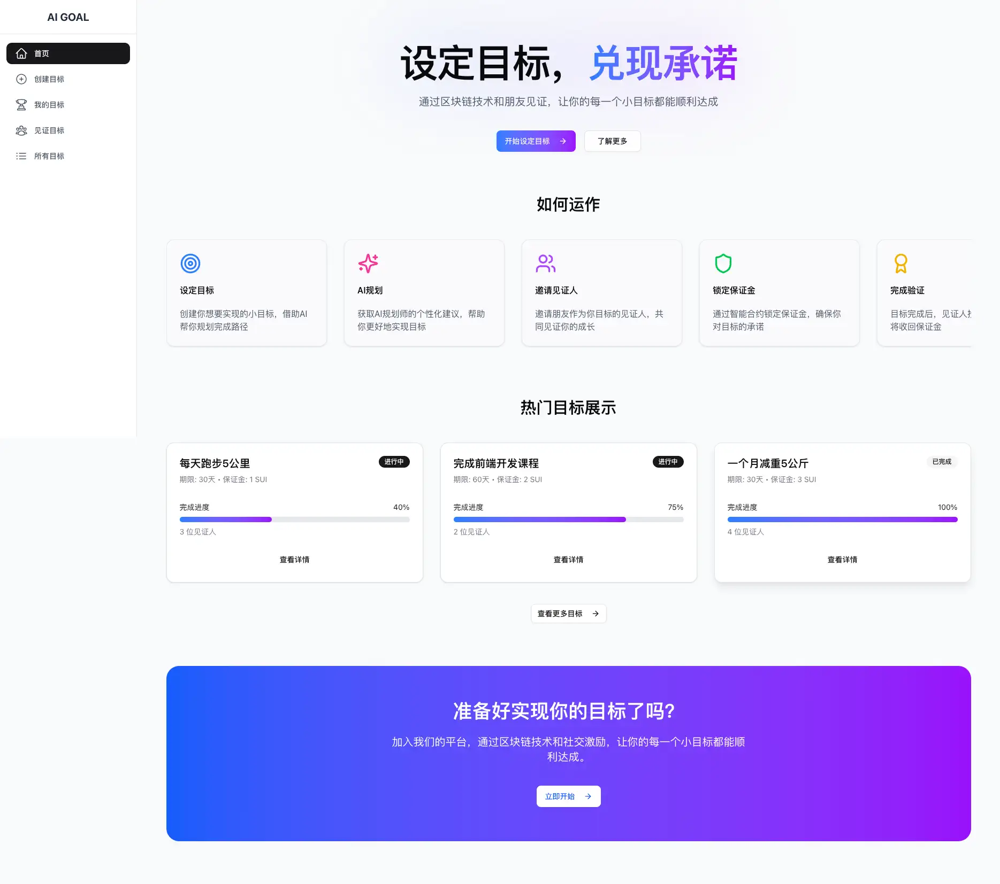
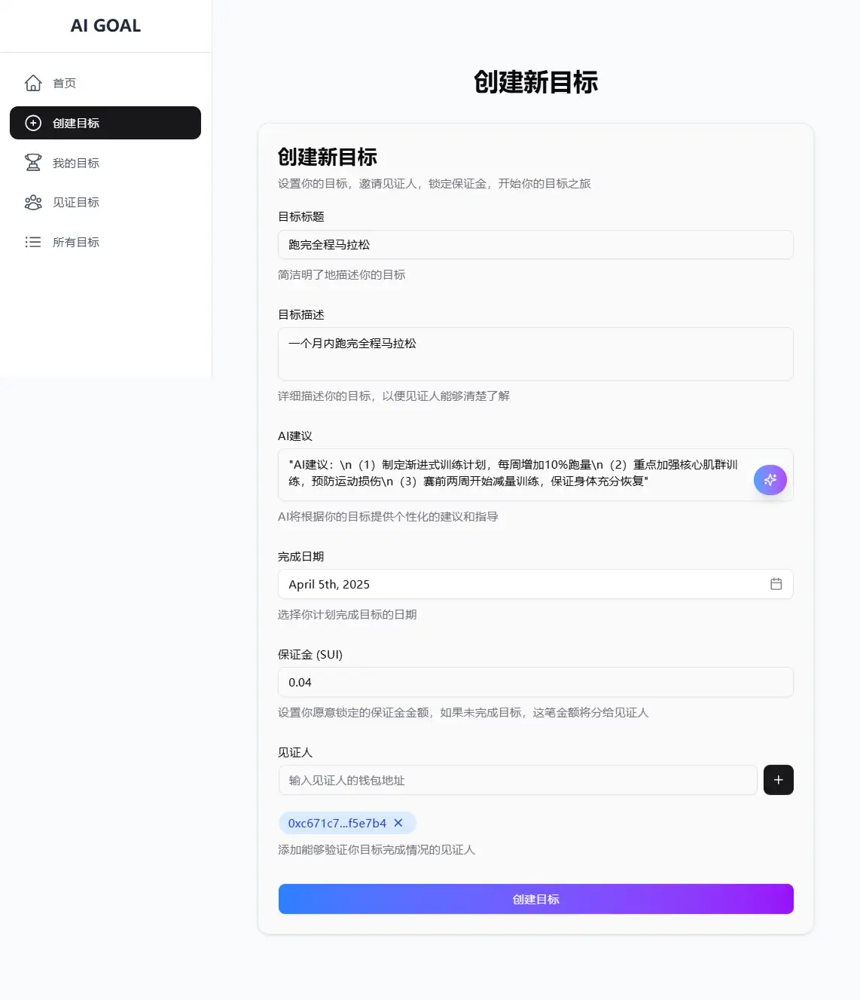
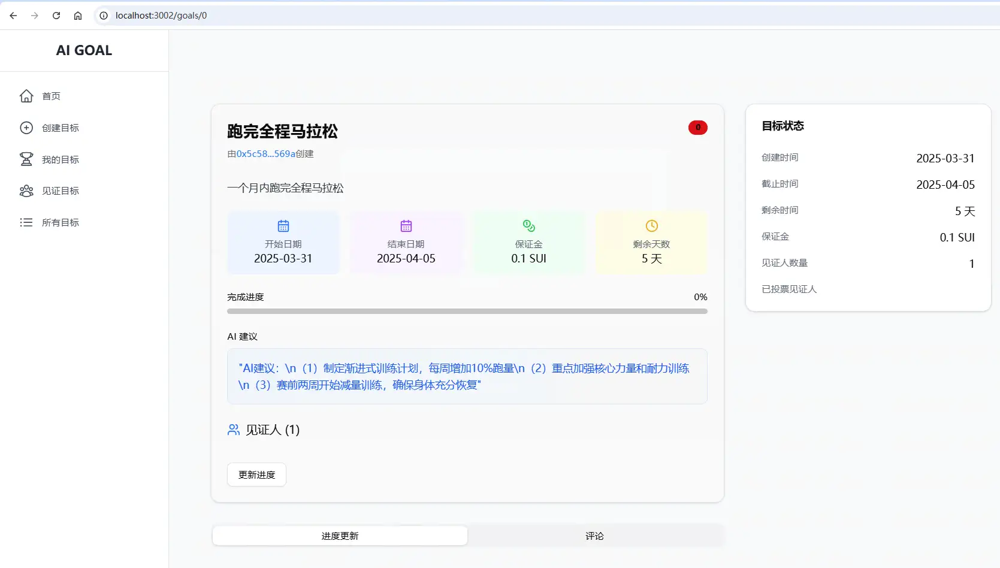

# AI-GOAL（AI目标规划师）Demo展示

## 1 项目首页

## 2 核心流程

### （1）设定目标

创建你想要实现的小目标，借助AI帮你规划完成路径

### （2）AI规划

获取AI规划师的个性化建议，帮助你更好地实现目标

### （3）邀请见证人

邀请朋友作为你目标的见证人，共同见证你的成长

### （4）锁定保证金

通过智能合约锁定保证金，确保你对目标的承诺

### （5）完成验证

目标完成后，见证人投票确认，你将收回保证金

## 3 设定目标

> 填写目标标题和描述后，可以获得完成目标的AI建议

## 4 目标查看

## 5 详情查看

## 6 其它功能，待实现