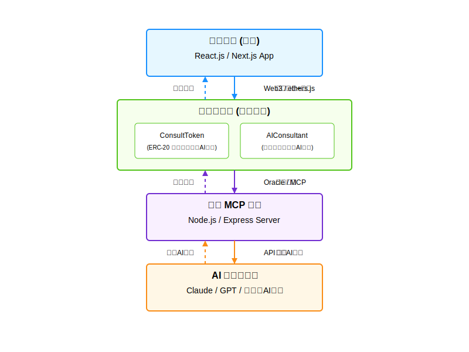

# 链智付 (ChainPayGate)

基于区块链的通用MCP支付网关，让用户可以使用代币一键调用各种API服务。

## PPT 网站

https://candid-truffle-8f5fb6.netlify.app/

## 项目说明

链智付是一个通用MCP支付网关，将API调用和支付整合为一个区块链交易，解决了Web3应用访问外部服务的难题。用户通过智能合约发送请求，支付代币，MCP代理服务连接区块链和外部API，确保响应安全记录在链上。

## 🚀 主要特点

- **一站式API调用和支付**：用户只需一次交易即可完成支付和API调用
- **通用MCP连接器**：允许区块链应用访问任何外部服务
- **服务提供者接口**：API提供者可轻松接入系统并获得代币支付
- **链上验证**：所有API调用和结果都在链上记录，可查询和验证

## 项目链接

- [项目详情](./chain-pay-gate/)
- [前端应用](./chain-pay-gate/frontend/)
- [MCP代理服务](./chain-pay-gate/mcp-proxy/)
- [智能合约](./chain-pay-gate/contracts/)

## 🏆 成就与亮点

- 将MCP与支付网关完美结合，创造了真正意义上的普遍适用Web3支付模型
- 解决了Web3与Web2服务交互中的支付问题
- 为API提供者打开了加密货币支付的新渠道

## 团队

- 肖杰克 (Jackie Xiao) - 全栈开发

## 项目架构

## ✨ 一句话解释

链智付让任何人可以一次性授权代币，然后无需重复确认交易即可多次调用各种API服务 - 就像区块链上的"API会员卡"！

## 🔍 我们解决了什么问题？

### 问题一：API调用与支付割裂
传统方式：注册服务→获取API密钥→设置支付方式→管理账单→调用API，步骤繁琐且分离。

**我们的方案**：一次授权，多次自动扣款调用API，类似预付费会员卡，一次设置，随时使用！

### 问题二：Web3应用无法便捷调用外部服务
传统方式：智能合约难以直接调用外部API，需要复杂的预言机设置。

**我们的方案**：通过MCP标准化接口和预授权机制，智能合约可以像调用内部函数一样轻松调用外部世界的任何API。

### 问题三：API提供商缺乏简单的加密支付入口
传统方式：API提供商需要对接传统支付系统，难以接入Web3生态。

**我们的方案**：一站式解决方案，API提供商注册服务后自动获得加密货币预授权支付通道。

## 💡 MCP如何使这一切成为可能？

**什么是MCP?** MCP (Multi-Chain Protocol) 允许智能合约安全地调用外部服务和数据，打破区块链的围墙花园。

在我们的项目中：
1. **预授权机制**：用户一次性授权代币，后续无需重复确认交易
2. **低摩擦调用**：授权后，用户发送MCP请求，系统自动验证授权并扣款
3. **链上验证**：MCP返回的结果带有加密证明，确保数据未被篡改
4. **跨链互操作**：未来可在任何支持MCP的区块链上使用相同服务

想象一下：就像办了一张充值会员卡，之后每次使用各种数字服务时无需重复付款，系统自动从余额中扣除，极大简化使用体验！

## 核心特性

### 💡 通用API调用网关
- 支持任何类型的API服务：数据查询、文件处理、AI分析、实时信息等
- 标准化的调用接口，开发者学一次即可调用所有服务
- 服务目录系统，一站浏览所有可用API

### 🔒 无缝支付体验
- 一次预授权，多次自动扣款，消除交易摩擦
- 无需每次调用都连接钱包和确认交易
- 智能合约自动分配收益给服务提供商
- 授权余额随时可查，接近用完时自动提醒

### 💰 激励机制
- API提供商可自定义服务价格和调用条件
- 服务质量评价系统，优质服务获得更多曝光
- 社区治理模式，用户参与决策平台发展方向

### 🌉 跨链互操作性
- 支持多链部署和调用
- 统一标准，各区块链可共享同一套API生态
- 打破区块链孤岛，实现真正的互联互通

## 技术实现

- **智能合约层**: 
  - 用户授权管理合约
  - 自动扣费处理合约
  - 服务注册管理合约

- **MCP代理层**: 
  - 标准MCP接口接入
  - 授权验证和扣费模块
  - 服务路由分发系统

- **服务执行层**:
  - 多样化API连接适配器
  - 结果验证和格式化系统

## 应用场景

### DeFi数据分析
交易员可以预授权代币，然后随时调用市场数据分析API，获取实时交易信号和市场指标，无需每次都确认交易。

### NFT元数据生成
NFT创建者可以一次授权，多次调用图像处理API，实时生成和修改NFT元数据，创作过程更为流畅。

### 区块链游戏
游戏开发者预授权后，游戏可无缝调用随机数生成、地图创建等外部服务，无需中断游戏体验。

### 去中心化社交应用
社交应用可以在用户授权下自动调用内容审核、翻译等API，在保持去中心化的同时提供丰富功能。

## 演示案例

1. **天气数据查询**  
   用户预授权代币后，可以多次查询不同城市天气，每次查询自动从授权额度中扣除少量代币。

2. **文件格式转换**  
   预授权后，批量提交多个文件转换任务，系统自动处理并按次扣费。

3. **FAQ知识库**  
   预授权后，多次向知识库提问，每次回答自动扣费，类似使用预付费的AI助手服务。

## 项目优势

- **革命性用户体验**: 从"每次付费"到"一次授权多次使用"，极大降低使用门槛
- **实用价值**: 解决Web3应用开发中的实际痛点
- **网络效应**: 服务越多，用户越多，形成良性循环
- **低进入门槛**: 对用户和API提供商都极为友好的接入体验

## 未来展望

- API服务市场：允许服务提供商上架和推广自己的API
- 服务组合：支持多API串联调用，创建复杂工作流
- 批量交易结算：优化链上操作，降低每次调用的gas成本
- 去中心化治理：由社区决定平台发展方向和服务标准

## 团队信息

- 开发者: Jackie
- 项目灵感: AI³ Growth Journey 3月迷你黑客松

## 许可证

MIT
