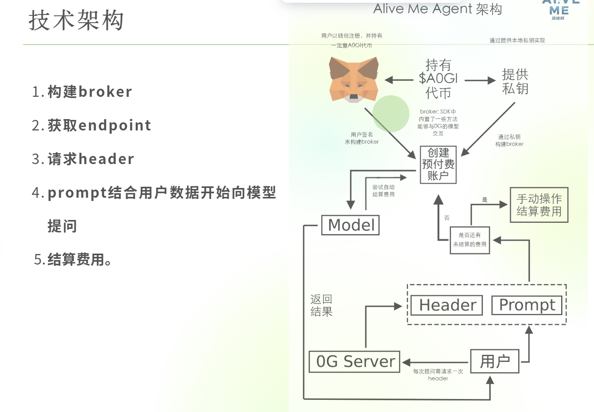

# ALiveMe.club 项目介绍

**官网链接**：ALiveMe.club  
心理人文社群管理工具 & 名片链接工具。

我们将社群推荐 Agent 上链到 **Web3**，通过调用 **0G** 的算力，帮助用户找到最适合他们的社群。

📄 详细介绍请参考 PPT：[点击查看](https://www.canva.cn/design/DAGltew6bxo/_x8RRnth7g2_o60ARh7sjw/edit)

---

# 团队信息

**Sunny**  
- Hackathon Weekly 上海主理人  
- AI心理社区 App 创始人  
- 文转商转码的多模态语言开发者  
- Hedy 编程教育中国区负责人  
- M2M Capital 合伙人

**Eugene**  
- Data Scientist  
- 香港 AI Agent 黑客松 第一名  

**吴杭**  
- 金融从业 AI Agent 搭建负责人  
- 2023 百度游戏大模王第一名  
- 18年资深游戏玩家，2年 AI 新玩家，致力于探索游戏化人生道路

**Min**  
- 计算机专业研一在读  
- 研究方向：网络安全与密码学

---

# 技术实现

## 技术架构图

  

## 用户路线图

  

---
