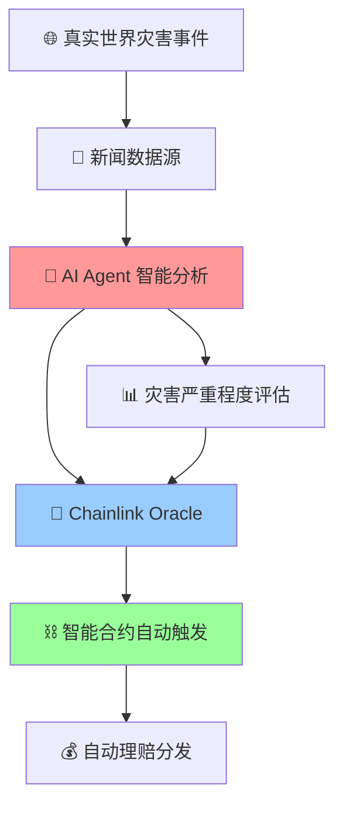

# 🌟 智能保险系统 - AI Agent + Chainlink + 公益保险

> 基于AI Agent、Chainlink Oracle和智能合约的下一代去中心化保险系统

## 🎯 项目概述

本项目是一个革命性的链上保险平台，通过**AI Agent智能分析**、**Chainlink实时数据源**和**智能合约自动化**的协同工作，实现真正去中心化、透明公正的灾害保险服务。

## ✨ 核心优势

### 🤖 AI Agent + 链下数据 + 链上保险的完美协同



### 🔗 Chainlink技术核心优势

#### ❌ 传统模式痛点
- 依赖管理员主观判断
- 人为决策存在偏见
- 处理速度慢，成本高
- 缺乏透明度和公信力

#### ✅ 我们的Chainlink解决方案
- **🔄 自动化触发**: Chainlink节点实时监控多源新闻数据
- **🎯 客观评估**: AI Agent基于大数据算法判断灾害严重程度
- **⚡ 即时响应**: 灾害发生后秒级触发理赔流程
- **🔍 完全透明**: 所有决策过程链上可查，无法篡改

### 💝 公益导向的创新机制

#### 🎁 资金分配模型
```
保险池资金分配：

如果没有发生灾害
├─ 20% 慈善捐赠 ❤️  → 自动转账给慈善机构
└─ 80% 下月继承 🔄  → 雪球效应增强保障

如果有发生灾害
├─ 60% - 100% 赔付给用户
└─ 剩下 下月继承 🔄  → 雪球效应增强保障
```

#### 🌟 社会价值
- **零利润运营**: 保险公司不收取任何费用
- **自动慈善**: 每笔理赔自动捐赠20%给慈善机构
- **资金传承**: 未理赔资金滚动到下月，形成更强保障

## 🏗️ 技术架构

### 核心组件
```
📁 项目结构
├── 🤖 AI Agent           # 新闻数据分析和灾害评估
├── 🔗 Chainlink Functions # 连接链下数据与链上合约
├── ⛓️ 智能合约            # 保险逻辑和资金管理
├── 🌐 前端界面            # 用户交互界面
└── 📊 监控面板            # 实时数据展示
```

### 🔄 工作流程

1. **数据采集**: AI Agent监控全球新闻源，识别自然灾害事件
2. **智能分析**: 基于机器学习算法评估灾害类型、位置、严重程度
3. **Oracle上链**: Chainlink Functions将分析结果安全传输到智能合约
4. **自动理赔**: 智能合约根据预设规则自动计算并分发理赔金
5. **公益捐赠**: 20%资金自动转账给预设慈善机构地址

## 🚀 关键创新

### 1. 🔮 预测性保险
- AI模型分析历史数据预测灾害概率
- 动态调整保险费率和理赔比例
- 提前预警高风险地区和时段

### 2. 🌐 全球数据融合
- 整合多语言新闻源（CNN、BBC、路透社等）
- 结合气象数据、地质数据、社交媒体数据
- 交叉验证确保数据准确性

### 3. ⚡ 秒级响应
- Chainlink节点24/7监控
- 灾害发生后1分钟内触发理赔
- 无需人工审核，完全自动化

### 4. 🛡️ 多重安全保障
- 多个Chainlink节点共识机制
- AI模型置信度阈值设定
- 异常检测和防欺诈算法

## 💡 商业模式

### 🎯 可持续发展
- **用户体验**: 透明、快速、公正的理赔体验
- **社会责任**: 每笔交易都为慈善事业贡献力量
- **技术创新**: 推动保险行业向自动化、智能化发展

### 📈 市场优势
- **降本增效**: 消除人工成本，提高处理效率
- **全球覆盖**: 不受地域限制，服务全球用户
- **实时响应**: 灾害后即时理赔，解决燃眉之急

## 🎮 快速体验

### 本地部署
```bash
# 1. 启动区块链节点
cd contract && anvil

# 2. 部署智能合约
forge script script/Deploy.s.sol --broadcast --rpc-url http://localhost:8545

# 3. 启动前端服务
cd frontend && pnpm dev

# 4. 访问应用
open http://localhost:3000
```

### 在线演示
🔗 [立即体验](http://localhost:3000) (需要MetaMask钱包)

## 🌍 社会影响

### 📊 预期效果
- **提升效率**: 理赔处理时间从天级降至分钟级
- **增强信任**: 完全透明的决策过程重建用户信心
- **普惠金融**: 降低保险门槛，惠及更多人群
- **公益贡献**: 每年为慈善机构提供稳定资金来源

## 🛠️ 技术栈

- **区块链**: Ethereum, Solidity ^0.8.20
- **Oracle**: Chainlink Functions, External Adapters
- **AI/ML**: Python, gemini模型
- **前端**: Next.js 15, React 19, TypeScript, Tailwind CSS
- **后端**: Node.js, Express, MongoDB
- **开发工具**: Foundry, Hardhat, MetaMask

---

**💫 让科技温暖世界，用区块链守护每一个家庭！**

*Built with ❤️ for a better world* 