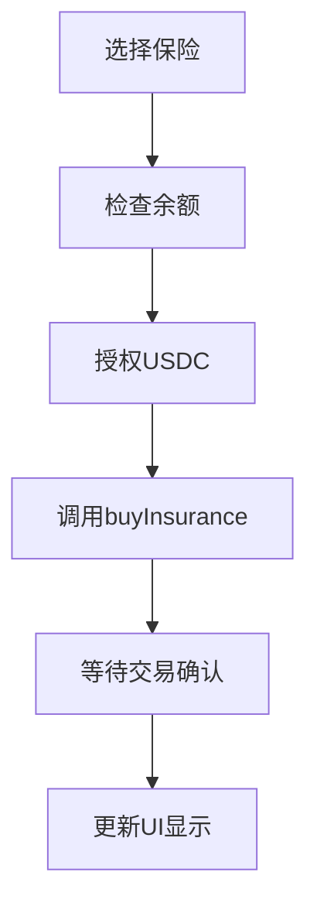
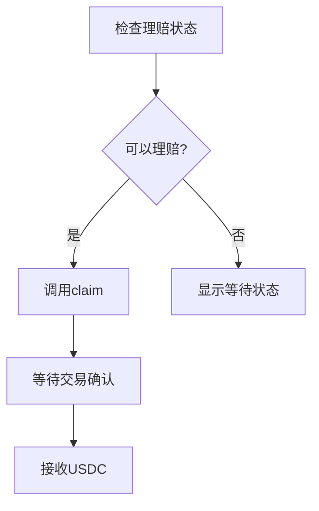
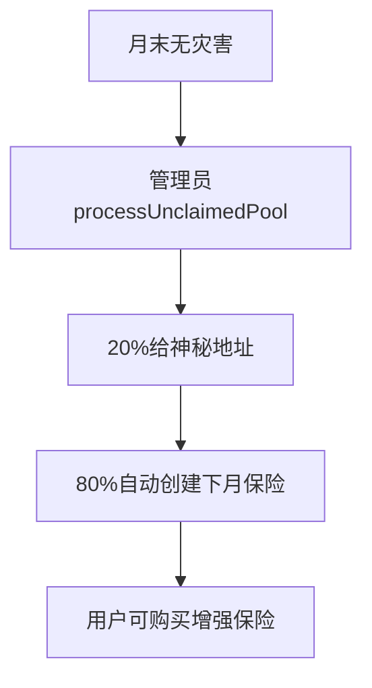

# 🔗 保险合约前端调用文档

## 📋 合约概览

### 主合约地址
- **InsuranceManager**: `0x...` (部署后填入)
- **MockUSDC**: `0x...` (测试代币地址)

### 核心功能
1. 🏗️ **创建保险** - 管理员创建新保险类型
2. 💰 **购买保险** - 用户用USDC购买保险份额
3. 🎁 **捐赠** - 向保险池捐赠(不获得份额)
4. 🌪️ **声明灾害** - 管理员声明灾害并设置理赔比例
5. 💸 **申请理赔** - 用户申请理赔
6. 🔄 **资金继承** - 未理赔资金自动滚动到下月

---

## 🔧 合约接口详解

### 1. 查询函数 (View/Pure)

#### 1.1 获取保险ID
```solidity
function getInsuranceId(string memory country, string memory disasterType, uint month, uint year) 
    public pure returns (bytes32)
```
**用途**: 生成保险的唯一标识符  
**参数**:
- `country`: 国家名 (如: "China")
- `disasterType`: 灾害类型 (如: "Typhoon") 
- `month`: 月份 (1-12)
- `year`: 年份 (≥1970)

**返回**: `bytes32` 保险ID

**前端调用示例**:
```javascript
const insuranceId = await contract.getInsuranceId("China", "Typhoon", 7, 2025);
```

#### 1.2 获取保险基本信息
```solidity
function insuranceInfos(bytes32 insuranceId) 
    public view returns (
        string memory country,
        string memory disasterType, 
        uint month,
        uint year,
        bool exists,
        bool disasterHappened,
        uint totalPool,
        uint totalShares,
        uint claimRatio,
        bool poolProcessed,
        uint inheritedAmount
    )
```

**前端调用示例**:
```javascript
const info = await contract.insuranceInfos(insuranceId);
console.log({
    country: info[0],
    disasterType: info[1], 
    month: info[2].toNumber(),
    year: info[3].toNumber(),
    exists: info[4],
    disasterHappened: info[5],
    totalPool: ethers.utils.formatUnits(info[6], 6), // USDC有6位小数
    totalShares: ethers.utils.formatUnits(info[7], 6),
    claimRatio: info[8].toNumber(),
    poolProcessed: info[9],
    inheritedAmount: ethers.utils.formatUnits(info[10], 6)
});
```

#### 1.3 获取用户保险份额
```solidity
function getUserShares(address user, bytes32 insuranceId) external view returns (uint)
```

**前端调用示例**:
```javascript
const userShares = await contract.getUserShares(userAddress, insuranceId);
const sharesFormatted = ethers.utils.formatUnits(userShares, 6);
```

#### 1.4 获取理赔状态
```solidity
function hasUserClaimed(address user, bytes32 insuranceId) external view returns (bool)
```

#### 1.5 获取潜在理赔金额
```solidity
function getPotentialClaim(address user, bytes32 insuranceId) external view returns (uint)
```

**前端调用示例**:
```javascript
const potentialClaim = await contract.getPotentialClaim(userAddress, insuranceId);
const claimAmount = ethers.utils.formatUnits(potentialClaim, 6);
console.log(`可理赔金额: ${claimAmount} USDC`);
```

#### 1.6 获取详细财务信息
```solidity
function getInsuranceFinancialInfo(bytes32 insuranceId) 
    external view returns (
        uint totalPool,
        uint userContributions, 
        uint inheritedAmount,
        uint availableForClaim,
        bool isProcessed
    )
```

**前端调用示例**:
```javascript
const financial = await contract.getInsuranceFinancialInfo(insuranceId);
console.log({
    totalPool: ethers.utils.formatUnits(financial[0], 6),
    userContributions: ethers.utils.formatUnits(financial[1], 6),
    inheritedAmount: ethers.utils.formatUnits(financial[2], 6),
    availableForClaim: ethers.utils.formatUnits(financial[3], 6),
    isProcessed: financial[4]
});
```

#### 1.7 获取继承链
```solidity
function getInheritanceChain(bytes32 startInsuranceId, uint maxLength) 
    external view returns (bytes32[] memory chain)
```

---

### 2. 用户交互函数

#### 2.1 购买保险
```solidity
function buyInsurance(bytes32 insuranceId, uint usdcAmount) external
```

**前端完整流程**:
```javascript
// 1. 先授权USDC
const usdcContract = new ethers.Contract(usdcAddress, usdcAbi, signer);
const amount = ethers.utils.parseUnits("1000", 6); // 1000 USDC

// 检查余额
const balance = await usdcContract.balanceOf(userAddress);
if (balance.lt(amount)) {
    throw new Error("USDC余额不足");
}

// 授权
const approveTx = await usdcContract.approve(insuranceManagerAddress, amount);
await approveTx.wait();

// 2. 购买保险
const buyTx = await contract.buyInsurance(insuranceId, amount);
await buyTx.wait();

console.log("保险购买成功!");
```

#### 2.2 捐赠
```solidity
function donate(bytes32 insuranceId, uint amount) external
```

**前端调用**:
```javascript
// 同样需要先授权USDC
const donateTx = await contract.donate(insuranceId, amount);
await donateTx.wait();
```

#### 2.3 申请理赔
```solidity
function claim(bytes32 insuranceId) external
```

**前端调用**:
```javascript
// 检查是否可以理赔
const potentialClaim = await contract.getPotentialClaim(userAddress, insuranceId);
if (potentialClaim.eq(0)) {
    alert("当前无法理赔或理赔金额为0");
    return;
}

// 申请理赔
const claimTx = await contract.claim(insuranceId);
await claimTx.wait();

console.log("理赔申请成功!");
```

---

### 3. 管理员函数 (仅Owner)

#### 3.1 创建保险
```solidity
function createInsurance(string memory country, string memory disasterType, uint month, uint year) 
    external onlyOwner
```

#### 3.2 声明灾害
```solidity
function declareDisaster(bytes32 insuranceId, uint claimRatio) external onlyOwner
```

**参数**:
- `claimRatio`: 理赔比例 (0-100)

#### 3.3 处理未理赔资金池
```solidity
function processUnclaimedPool(bytes32 insuranceId) external onlyOwner
```

#### 3.4 设置神秘地址
```solidity
function setMysteriousAddress(address _mysteriousAddress) external onlyOwner
```

#### 3.5 设置分配比例
```solidity
function setDistributionRatios(uint _mysteriousRatio, uint _inheritanceRatio) external onlyOwner
```

---

## 📱 前端界面建议

### 主要页面结构

#### 1. 保险市场页面
- **功能**: 展示所有可购买的保险
- **数据获取**: 遍历保险类型，调用`insuranceInfos()`
- **显示内容**:
  ```
  🌪️ 中国台风保险 - 2025年7月
  总池: 5,000 USDC | 继承: 1,200 USDC | 参与人数: 15
  [购买] [捐赠] [详情]
  ```

#### 2. 我的保险页面
- **功能**: 展示用户已购买的保险
- **数据获取**: 
  ```javascript
  const userShares = await contract.getUserShares(userAddress, insuranceId);
  const hasClaimed = await contract.hasUserClaimed(userAddress, insuranceId);
  const potentialClaim = await contract.getPotentialClaim(userAddress, insuranceId);
  ```
- **显示内容**:
  ```
  📋 我的保险
  ├─ 中国台风 2025-07: 持有 500 USDC | 可理赔: 650 USDC [理赔]
  ├─ 日本地震 2025-08: 持有 300 USDC | 等待灾害结果 [查看]
  └─ 印度洪水 2025-06: 已理赔 420 USDC ✅
  ```

#### 3. 购买保险页面
```javascript
// 关键验证逻辑
const validatePurchase = async (insuranceId, amount) => {
    const info = await contract.insuranceInfos(insuranceId);
    
    // 检查保险是否存在
    if (!info.exists) throw new Error("保险不存在");
    
    // 检查是否为未来月份
    const currentTime = Math.floor(Date.now() / 1000);
    // 根据实际需求检查时间
    
    // 检查USDC余额和授权
    const balance = await usdcContract.balanceOf(userAddress);
    const allowance = await usdcContract.allowance(userAddress, contractAddress);
    
    if (balance.lt(amount)) throw new Error("USDC余额不足");
    if (allowance.lt(amount)) {
        // 需要授权
        return { needApproval: true };
    }
    
    return { needApproval: false };
};
```

#### 4. 理赔页面
```javascript
// 理赔状态检查
const getClaimStatus = async (insuranceId, userAddress) => {
    const info = await contract.insuranceInfos(insuranceId);
    const userShares = await contract.getUserShares(userAddress, insuranceId);
    const hasClaimed = await contract.hasUserClaimed(userAddress, insuranceId);
    const potentialClaim = await contract.getPotentialClaim(userAddress, insuranceId);
    
    if (userShares.eq(0)) return "未购买";
    if (hasClaimed) return "已理赔";
    if (!info.disasterHappened && !info.poolProcessed) return "等待灾害结果";
    if (potentialClaim.eq(0)) return "无理赔(无灾害)";
    return "可理赔";
};
```

---

## 📊 事件监听

### 重要事件
```solidity
event InsuranceCreated(bytes32 indexed insuranceId, string country, string disasterType, uint month, uint year);
event InsurancePurchased(address indexed user, bytes32 indexed insuranceId, uint usdcAmount, uint shares);
event DisasterDeclared(bytes32 indexed insuranceId, uint claimRatio);
event Claimed(address indexed user, bytes32 indexed insuranceId, uint claimAmount);
event FundsInherited(bytes32 indexed fromInsuranceId, bytes32 indexed toInsuranceId, uint amount);
```

### 前端监听示例
```javascript
// 监听购买事件
contract.on("InsurancePurchased", (user, insuranceId, usdcAmount, shares, event) => {
    if (user === userAddress) {
        console.log(`购买成功: ${ethers.utils.formatUnits(usdcAmount, 6)} USDC`);
        // 更新UI
    }
});

// 监听灾害声明
contract.on("DisasterDeclared", (insuranceId, claimRatio, event) => {
    console.log(`灾害声明: 理赔比例 ${claimRatio}%`);
    // 更新相关保险状态
});
```

---

## 🎯 核心业务流程

### 用户购买保险流程


### 理赔流程


### 继承机制流程


---

## 💡 前端开发建议

1. **使用Web3库**: ethers.js 或 web3.js
2. **钱包集成**: MetaMask, WalletConnect
3. **UI框架**: React + Ant Design 或 Vue + Element Plus
4. **状态管理**: Redux 或 Vuex 管理保险数据
5. **实时更新**: 定时轮询 + 事件监听
6. **错误处理**: 友好的错误提示和重试机制

这份文档涵盖了合约的所有核心功能，可以直接用于前端开发！
