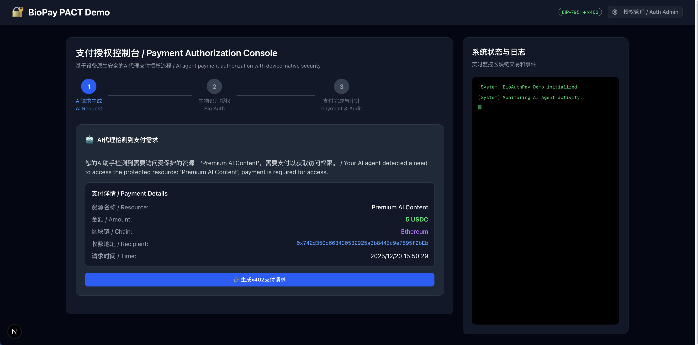
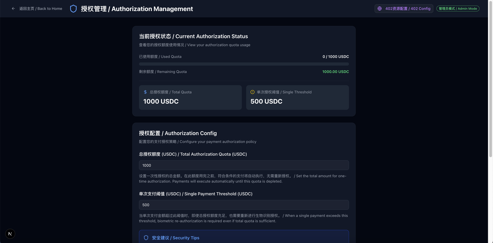
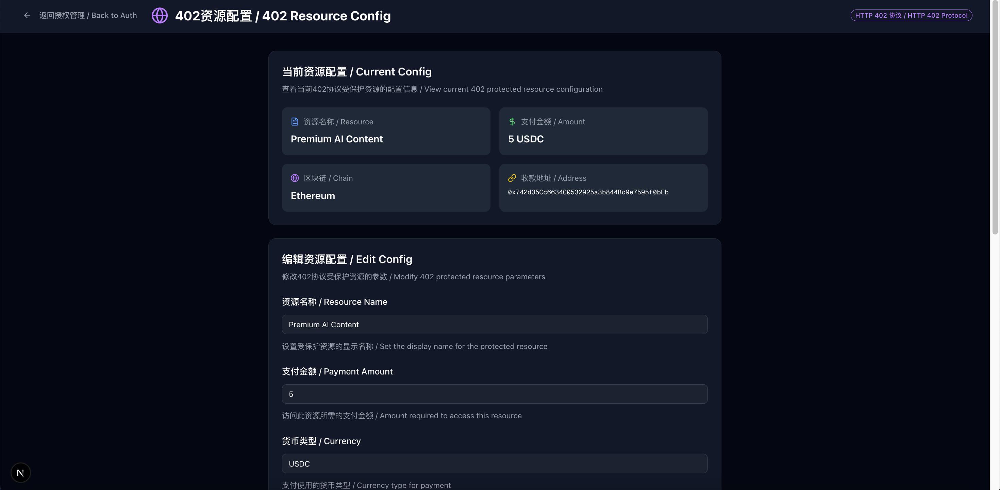

# BioAuthPay 演示文档

## 演示链接

- 本地演示: http://localhost:3000
- 在线Demo: 待部署
- GitHub仓库: https://github.com/yourusername/BioAuthPay
- 演示视频: 待录制

## 快速体验

### 启动本地演示

```bash
# 克隆项目
git clone https://github.com/yourusername/BioAuthPay.git
cd BioAuthPay

# 安装依赖
npm install

# 启动开发服务器
npm run dev

# 访问 http://localhost:3000
```

## 演示截图

### 1. 主界面 - 支付授权控制台



功能展示:
- 三步式支付流程指示器
- AI请求生成与支付详情
- 实时系统日志监控
- 双语界面(中文/English)

### 2. AI请求生成

演示要点:
- AI检测到需要访问受保护资源
- 显示支付详情(资源名称、金额、区块链、收款地址)
- 生成x402支付请求按钮
- 请求ID和时间戳

### 3. 生物识别授权弹窗

关键特性:
- 圆形指纹按钮，居中显示
- 支持多种设备类型(iPhone Face ID、Android指纹等)
- 中英文双行显示，文字清晰可见
- 授权中动画效果
- 隐私保护提示

### 4. 支付完成页面

展示内容:
- 成功动画和确认信息
- 完整的支付详情
- 模拟交易哈希
- 区块号和Gas消耗
- 审计追踪清单

### 5. 授权管理后台



配置功能:
- 当前授权状态概览
- 额度使用进度条(已用/剩余)
- 总授权额度设置
- 单次支付阈值配置
- 安全建议提示

### 6. 402资源配置



配置选项:
- 资源名称
- 支付金额和货币类型
- 区块链网络选择
- 收款地址
- 资源描述
- HTTP 402协议说明

### 7. 系统日志实时监控

日志特性:
- 不同类型日志用颜色区分
- 自动滚动到最新日志
- 时间戳显示
- 闪烁光标表示活跃状态

## 演示流程

### 场景一：小额支付自动执行(无需生物授权)

初始配置:
- 总授权额度: 1000 USDC
- 单次支付阈值: 500 USDC
- 已用额度: 0 USDC

步骤:

1. 配置402资源
   - 导航到 授权管理 → 402资源配置
   - 设置资源名称: Netflix Chain Subscription
   - 设置支付金额: 15 USDC
   - 保存配置

2. 返回主控制台
   - 点击顶部导航返回主页
   - 看到当前步骤为"步骤1：AI请求生成"

3. 生成支付请求
   - 点击 生成x402支付请求 按钮
   - 系统检查: 15 USDC < 500 USDC(阈值) ✓
   - 系统检查: 剩余额度 1000 USDC > 15 USDC ✓

4. 自动执行支付
   - 无需生物授权，直接跳到步骤3
   - 显示"支付成功"页面
   - 已用额度更新: 15 USDC
   - 剩余额度: 985 USDC
   - 生成模拟交易哈希

5. 查看审计日志
   - 右侧日志显示完整流程
   - 点击 查看完整审计日志 按钮
   - 显示详细的审计追踪信息

关键亮点:
- 无感支付: 用户无需任何操作，AI自动完成
- 实时反馈: 日志清晰记录每一步
- 额度扣除: 自动追踪使用情况

---

### 场景二：大额支付需要生物授权

初始配置:
- 总授权额度: 1000 USDC
- 单次支付阈值: 500 USDC
- 已用额度: 15 USDC(上一笔Netflix支付)

步骤:

1. 配置高额资源
   - 导航到 402资源配置
   - 设置资源名称: Premium AI Data Analysis
   - 设置支付金额: 600 USDC
   - 保存配置

2. 生成支付请求
   - 返回主控制台
   - 点击 重置演示 清空状态(或继续当前流程)
   - 点击 生成x402支付请求
   - 系统检查: 600 USDC > 500 USDC(阈值) ❗

3. 触发生物授权弹窗
   - 自动弹出生物识别授权弹窗
   - 显示标题: "支付授权确认 / Payment Authorization"
   - 显示描述: "此次支付需要生物识别授权"
   - 可选择设备类型(演示中已选择)

4. 完成生物授权
   - 点击圆形指纹按钮
   - 按钮显示 授权中.../Authenticating...
   - 指纹图标开始跳动动画
   - 2秒后授权完成

5. 授权成功，自动支付
   - 弹窗自动关闭
   - 进入步骤3: 支付完成
   - 显示成功动画
   - 更新额度: 已用615 USDC，剩余385 USDC

关键亮点:
- 安全控制: 大额支付必须用户确认
- 流畅体验: 弹窗式授权不打断流程
- 即时反馈: 授权后立即执行支付

---

### 场景三：额度不足触发授权

初始配置:
- 总授权额度: 1000 USDC
- 单次支付阈值: 500 USDC
- 已用额度: 960 USDC
- 剩余额度: 40 USDC

步骤:

1. 配置支付金额
   - 设置资源金额: 80 USDC(小于阈值500 USDC)
   - 保存配置

2. 生成支付请求
   - 点击 生成x402支付请求
   - 系统检查: 80 USDC < 500 USDC(阈值) ✓
   - 系统检查: 剩余额度 40 USDC < 80 USDC ❗

3. 触发授权(额度不足)
   - 虽然金额低于阈值，但额度不足，仍需授权
   - 弹出生物识别授权弹窗
   - 日志显示: [x402 Protocol] 额度不足，需要生物识别授权

4. 重新授权额度
   - 完成生物识别授权
   - 系统重置已用额度为 0
   - 总授权额度保持 1000 USDC

5. 执行支付
   - 扣除 80 USDC
   - 新的已用额度: 80 USDC
   - 新的剩余额度: 920 USDC

关键亮点:
- 智能检测: 自动识别额度不足情况
- 灵活策略: 即使小额也会在必要时要求授权
- 透明提示: 日志清晰说明授权原因

---

## 特色功能演示

### 1. 实时日志系统

功能: 右侧控制台实时显示系统事件

日志类型:
- [System] - 白色: 系统状态
- [AI Agent] - 绿色: AI代理活动
- [x402 Protocol] - 青色: 402协议处理
- [EIP-7951] - 紫色: 生物识别签名
- [Blockchain] - 蓝色: 区块链交易
- [Audit] - 黄色: 审计追踪

演示:
1. 点击 生成x402支付请求
2. 观察日志实时更新
3. 完成支付后点击 查看完整审计日志
4. 查看详细的审计信息展开

### 2. 授权策略配置

功能: 灵活配置授权额度和阈值

演示步骤:
1. 点击顶部 授权管理 / Auth Admin
2. 查看当前授权状态(进度条、已用/剩余)
3. 修改总授权额度(如改为 2000 USDC)
4. 修改单次支付阈值(如改为 800 USDC)
5. 点击 保存配置(需生物识别)
6. 完成生物识别授权
7. 配置立即生效

关键亮点:
- 修改授权配置本身需要生物识别保护
- 进度条直观显示额度使用情况
- 颜色变化提示额度状态(充足/警告/不足)

### 3. HTTP 402资源保护

功能: 配置受保护资源的付费参数

演示步骤:
1. 在授权管理页面点击 402资源配置 / 402 Config
2. 查看当前资源配置概览
3. 编辑资源参数:
   - 资源名称: Premium AI Content
   - 支付金额: 5
   - 货币类型: USDC
   - 区块链: Ethereum
   - 收款地址: 0x742d35Cc6634C0532925a3b844Bc9e7595f0bEb
4. 点击 保存配置(402配置无需生物识别)
5. 返回主控制台测试新配置

关键亮点:
- 支持多种资源类型
- 灵活的价格设置
- HTTP 402协议说明帮助理解

### 4. 多设备生物识别

功能: 模拟不同设备的生物识别

支持设备:
- iPhone Face ID
- Android Fingerprint
- Windows Hello
- Mac Touch ID

演示:
1. 在生物识别弹窗中选择不同设备类型
2. 观察日志中显示对应的设备信息
3. 每个设备的签名过程独立模拟

### 5. 完整审计追踪

功能: 查看支付的完整审计日志

演示:
1. 完成一笔支付
2. 点击 查看完整审计日志
3. 查看展开的审计信息:
   - 交易哈希
   - 区块号和Gas消耗
   - 事件日志(PaymentRequested、SignatureVerified、Transfer、PaymentCompleted)
   - 智能合约调用链
   - 安全验证清单

关键亮点:
- 所有信息都模拟了真实的区块链交易
- 提供完整的审计链条
- 可用于合规和追溯

---

## 实现亮点

### 1. 智能授权决策引擎

技术实现: lib/store.ts 中的 checkAuthRequired() 函数

亮点:
- 双重检查机制(阈值 + 余额)
- 灵活的策略配置
- 清晰的决策逻辑

### 2. 无感支付体验

流程优化:
1. AI检测支付需求 → 自动检查授权策略
2. 符合条件 → 直接执行，跳过步骤2
3. 需要授权 → 弹窗确认
4. 授权成功 → 自动关闭并执行

亮点:
- 最小化用户交互
- 保持安全的同时提升体验
- 透明的状态转换

### 3. 模块化组件设计

可复用组件:
- BioAuthModal: 通用生物识别弹窗
- 支持自定义标题和描述
- 统一的授权流程处理
- 在多个页面复用(主控制台、授权管理)

亮点:
- DRY原则
- 易于维护和扩展
- 一致的用户体验

### 4. 实时状态同步

技术方案: Zustand全局状态管理

优势:
- 所有页面实时同步
- 配置修改立即生效
- 无需刷新页面

### 5. 国际化友好

实现方式:
- 所有界面文本双语显示
- 格式: 中文 / English
- 无需i18n库，简单直接

---

## 技术架构亮点

### 前端技术

- Next.js 16 + Turbopack: 极速开发体验
- React 19: 最新特性支持
- Zustand: 轻量级状态管理
- shadcn/ui + Tailwind CSS 4: 现代化UI

### 核心标准

- EIP-7951: 设备原生安全
- HTTP 402: 标准化支付协议
- secp256r1: 与设备安全芯片兼容

### 安全特性

- 私钥不离开设备: 模拟真实安全芯片
- 生物识别保护: 每次签名都需授权
- 链上审计: 所有支付永久可查

---

## 已知限制与未来改进

### 当前限制

1. 仅为演示项目
   - 生物识别为模拟实现
   - 区块链交易为模拟数据
   - 未连接真实智能合约

2. 本地运行
   - 需要本地启动开发服务器
   - 尚未部署到生产环境

3. 功能简化
   - 仅支持单一币种(USDC)
   - 仅支持单条链(演示用)
   - 未实现真实的设备签名

### 未来改进方向

1. 真实集成
   - 集成Web Authentication API实现真实生物识别
   - 部署智能合约到测试网
   - 连接真实钱包(MetaMask等)

2. 功能增强
   - 多链支持
   - 多币种支付
   - 社交恢复机制
   - 批量支付处理

3. 生态扩展
   - 开发者SDK
   - 服务提供商接入
   - 支付市场平台

4. 性能优化
   - 代码分割和懒加载
   - 服务端渲染优化
   - 缓存策略

5. 安全增强
   - 多重签名支持
   - 异常检测和预警
   - 合规性审计

---

## 演示视频脚本(5分钟)

### 第1分钟：项目介绍

"大家好，我来展示BioAuthPay - 一个创新的AI代理支付授权系统。

核心理念：用户通过生物识别一次性授权额度，AI可以在授权范围内自动完成支付，无需每次确认。

这解决了AI自动化支付中的安全性与便捷性矛盾。"

### 第2分钟：小额自动支付

"首先演示小额支付场景。

我在402资源配置中设置Netflix订阅为15 USDC。

返回主控制台，点击生成支付请求。

注意：系统检查金额低于阈值、额度充足，直接自动执行！

无需任何确认，AI完成了支付。右侧日志记录了全过程。"

### 第3分钟：大额需要授权

"现在演示大额支付。

我配置一个600 USDC的高级服务，超过了500 USDC的阈值。

生成请求后，系统自动弹出生物识别授权弹窗。

点击指纹按钮，授权中...完成！

弹窗自动关闭，支付立即执行。既安全又便捷。"

### 第4分钟：授权管理

"来看授权管理后台。

这里可以看到额度使用情况，进度条直观展示。

我可以修改总授权额度和单次阈值。

注意：修改配置本身也需要生物识别授权，确保安全。"

### 第5分钟：技术亮点总结

"BioAuthPay的核心技术亮点：

1. EIP-7951标准 - 设备原生安全，私钥永不离开设备
2. HTTP 402协议 - 标准化的Web资源付费访问
3. 智能授权策略 - 灵活的额度和阈值配置
4. 完整审计追踪 - 所有支付链上可查

这是未来AI自动化支付的一个可能方向。谢谢大家！"

---

## 联系方式

- 项目作者: [你的名字]
- 邮箱: [你的邮箱]
- GitHub: https://github.com/yourusername
- Twitter: @yourusername

---

## 许可证

MIT License - 欢迎使用和参考本项目

---

BioAuthPay - 让AI支付像指纹解锁一样简单、安全！

最后更新：2025年12月
